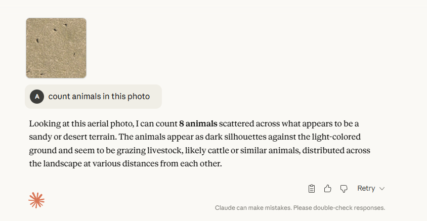
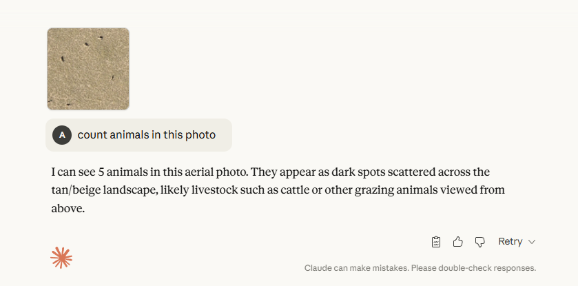
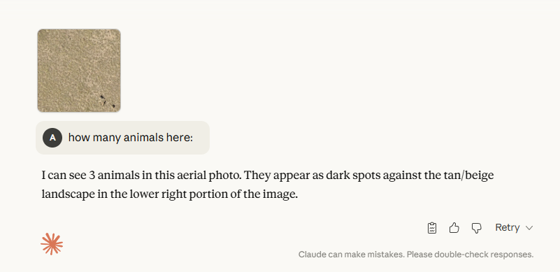

***Sonnet-4.0** counted saigas in image **INCORRECTLY***

***Opus-4.1** counted saigas in image **CORRECTLY***

*2'nd test of the **Opus-4.1**, and that's **CORRECT***

## 1'st Conclusion
####  We can use **Opus-4.1** for benchmarking our approaches

# Yolo models testing:
## Without post-training:
### Yolo11x - confidence:0.1

[folder-to-yolo11x-results](./predicted_images-yolo11x/)
### Yolov8x - confidence:0.1

[folder-to-yolov8x-results](./predicted_images-yolov8x/)
