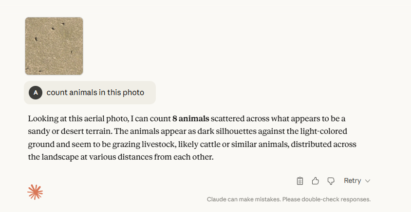
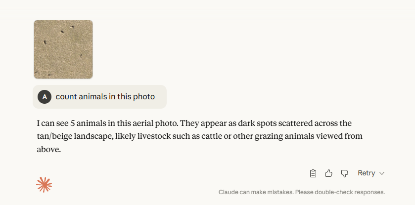
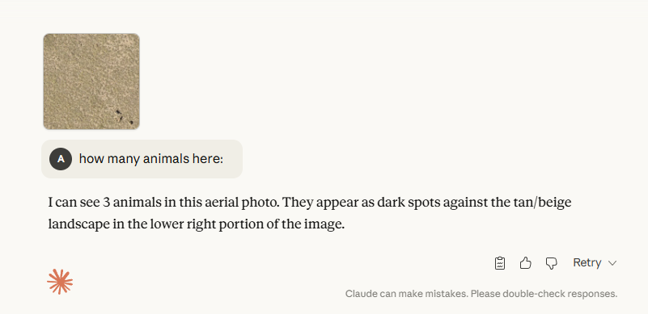
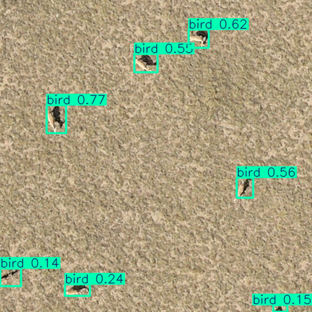
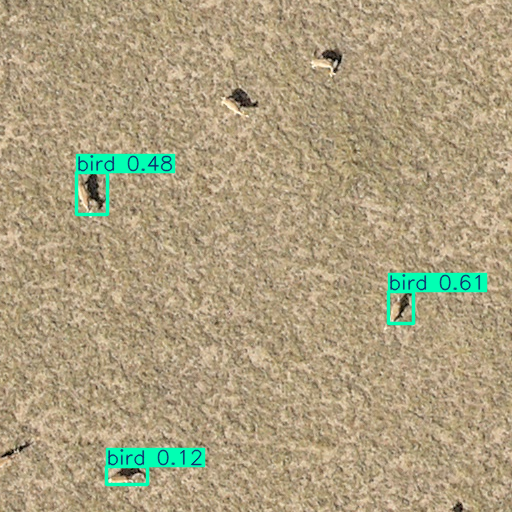

# 🦌 Saiga - Система автоматического обнаружения сайгаков

Проект для автоматического обнаружения и подсчета сайгаков на аэрофотосъемках с использованием YOLO-моделей и техники разбиения изображений на фрагменты.

## 📋 Описание проекта

**Saiga** - это комплексная система компьютерного зрения для обнаружения сайгаков на крупноформатных аэрофотоснимках. Проект использует современные модели YOLO (YOLO11x, YOLOv8x) в сочетании с методом разбиения изображений на перекрывающиеся фрагменты для эффективной обработки больших изображений.

### 🎯 Основные возможности

- ✅ Обнаружение сайгаков на аэрофотоснимках высокого разрешения
- ✅ Разбиение больших изображений на перекрывающиеся фрагменты 
- ✅ Поддержка моделей YOLO11x и YOLOv8x
- ✅ Обработка дублирующихся детекций с помощью IoU
- ✅ Визуализация результатов и процесса разбиения
- ✅ Бенчмаркинг с использованием различных AI-моделей
- ✅ Автоматизированная обработка батчей изображений
- ✅ Обучение собственных моделей YOLO
- ✅ Фильтрация выбросов и постобработка результатов
- ✅ Автоматическая аннотация датасетов

## 🛠️ Технический стек

### Основные зависимости
- **Python 3.12+**
- **PyTorch 2.9.0** (с поддержкой CUDA 12.9)
- **Ultralytics YOLO** (v8.3.203+)
- **OpenCV**
- **PIL/Pillow**
- **Pandas**
- **Matplotlib**
- **NumPy**
- **Scikit-learn**
- **PyYAML**
- **tqdm**
- **python-dotenv**

### Управление зависимостями
- **uv** - Быстрый менеджер пакетов Python
- **pyproject.toml** - Конфигурация проекта
- **uv.lock** - Зафиксированные версии зависимостей

## 📁 Структура проекта

```
Saiga/
├── 📂 src/main/python/                 # Основной исходный код
│   ├── 📂 image_slicer/               # Разбиение изображений на фрагменты
│   │   ├── 🔧 image_slicer.py         # Основной модуль разбиения
│   │   └── 📊 visualize_slicing.py    # Визуализация процесса разбиения
│   ├── 📂 model/                      # Модели машинного обучения
│   │   ├── 🧠 yolo.py                 # YOLO модели (YOLO11x, YOLOv8x)
│   │   └── 🔍 detr.py                 # DETR модель
│   ├── 📂 iou_filter/                 # Фильтрация дубликатов
│   │   └── 🔧 iou_filter.py           # IoU фильтрация детекций
│   ├── 📂 outlier_filter/             # Фильтрация выбросов
│   │   └── 🔧 outlier_filter.py       # Удаление аномальных детекций
│   ├── 📂 benchmarking/               # Бенчмаркинг и тестирование
│   │   ├── 📊 benchmarking.csv         # Данные бенчмарка
│   │   ├── 📊 benchmarking_with_predictions*.csv  # Результаты с предсказаниями
│   │   └── 📓 becnhmark_collection_automation.ipynb
│   ├── 📂 training/                   # Обучение моделей
│   │   ├── 📓 train-yolo11-object-detection-on-custom-dataset.ipynb
│   │   └── 📂 results/train4/         # Результаты обучения
│   │       ├── 📊 results.csv         # Метрики обучения
│   │       ├── 📈 *.png              # Графики и визуализации
│   │       └── 📂 weights/            # Обученные веса
│   │           ├── 🏆 best_4.pt       # Лучшая модель
│   │           └── 🔄 last.pt         # Последняя эпоха
│   ├── 📂 annotation/                 # Автоматическая аннотация
│   │   └── 📓 automated-dataset-annotation-and-evaluation-with-grounding-dino-and-sam.ipynb
│   └── 📂 utils/                      # Утилиты
│       └── 🔧 utils.py               # Вспомогательные функции
├── 📂 src/main/resources/             # Ресурсы и конфигурация
│   ├── ⚙️ config.py                   # Основные настройки
│   ├── 🏆 best_4.pt                   # Обученная модель
│   ├── 🧠 yolo11x.pt                  # YOLO11x веса
│   └── 🧠 yolov8x.pt                  # YOLOv8x веса
├── 📂 dataset/                        # Датасеты изображений
│   ├── 📁 0.0.0/                     # Версия 0.0.0 (архивы)
│   ├── 📁 0.0.1/                     # Версия 0.0.1 (211 изображений)
│   ├── 📁 1.0.0/                     # Версия 1.0.0 (предсказания YOLO11x)
│   ├── 📁 1.0.1/                     # Версия 1.0.1 (предсказания YOLO11x)
│   └── 📁 2.0.0/                     # Версия 2.0.0 (1148 файлов: 615 txt, 533 png)
├── 📂 slices/                         # Фрагменты изображений
├── 📂 slices-2/                       # Дополнительные фрагменты
├── 📂 predicted_images-*/             # Результаты различных моделей
├── 📂 predicted_images_with_annotations-*/  # Результаты с аннотациями
├── 📂 iou_filtered-*/                 # Результаты после IoU фильтрации
├── 📂 readme_content/                 # Медиа для README
├── 📓 test.ipynb                      # Основной ноутбук тестирования
├── 📓 get_start.ipynb                 # Быстрый старт
├── 📓 pipeline.ipynb                  # Пайплайн обработки
├── 📓 pipeline_2.ipynb                # Альтернативный пайплайн
├── ⚙️ pyproject.toml                  # Конфигурация проекта
├── 📋 uv.lock                         # Зависимости
└── 🧠 yolo11x.pt                      # Основная модель
```

## 🚀 Быстрый старт

### 1. Установка зависимостей

```bash
# Установка uv (если не установлен)
pip install uv

# Синхронизация зависимостей
uv sync
```

### 2. Активация окружения

```bash
# Активация виртуального окружения
source .venv/bin/activate  # Linux/Mac
# или
.venv\Scripts\activate     # Windows
```

### 3. Разбиение изображения на фрагменты

```bash
python src/main/python/image_slicer/image_slicer.py \
    --image_path "path/to/your/image.jpg" \
    --overlap_percentage 30 \
    --destination_folder "./slices/" \
    --slice-size 512
```

### 4. Запуск обнаружения

Используйте `test.ipynb` для комплексной обработки изображений с моделями YOLO.

### 5. Обучение собственной модели

```bash
# Запуск обучения YOLO11
jupyter notebook src/main/python/training/train-yolo11-object-detection-on-custom-dataset.ipynb
```

## 🔧 Основные инструменты

### Image Slicer (Разбиение изображений)

Инструмент для разбиения больших аэрофотоснимков на перекрывающиеся фрагменты:

```python
python src/main/python/image_slicer/image_slicer.py \
    --image_path "image.jpg" \
    --overlap_percentage 30 \
    --destination_folder "./slices/" \
    --slice-size 512
```

**Параметры:**
- `--image_path`: Путь к исходному изображению
- `--overlap_percentage`: Процент перекрытия между фрагментами (0-99)
- `--destination_folder`: Папка для сохранения фрагментов
- `--slice-size`: Размер фрагмента в пикселях (по умолчанию: 512)

### Визуализация процесса разбиения

```python
python src/main/python/image_slicer/visualize_slicing.py \
    "image.jpg" \
    30 \
    --tile-size 512 \
    --detailed
```

### IoU Фильтрация дубликатов

```python
python src/main/python/iou_filter/iou_filter.py \
    --input_folder "predicted_images_with_annotations-best_4-0.4" \
    --output_folder "iou_filtered-best_4-0.5" \
    --iou_threshold 0.5
```

### Фильтрация выбросов

```python
python src/main/python/outlier_filter/outlier_filter.py \
    --input_folder "iou_filtered-best_4-0.5" \
    --output_folder "outlier_filtered-best_4-0.5" \
    --k_threshold 3
```

## 📊 Результаты бенчмаркинга

### Сравнение AI-моделей для подсчета сайгаков

| Модель | Точность | Примечания |
|--------|----------|------------|
| **Claude Opus-4.1** | ✅ **КОРРЕКТНО** | Точный подсчет сайгаков |
| **Claude Sonnet-4.0** | ❌ **НЕКОРРЕКТНО** | Неточный подсчет |
| **YOLO11x** (conf: 0.1) | 🔄 **В процессе** | Обнаружено 42 объекта |
| **YOLOv8x** (conf: 0.1) | 🔄 **В процессе** | В разработке |

### Детальные результаты тестирования

#### Claude Sonnet-4.0 - подсчет сайгаков в изображении **НЕКОРРЕКТНО**


#### Claude Opus-4.1 - подсчет сайгаков в изображении **КОРРЕКТНО**


#### Второй тест Claude Opus-4.1 - результат **КОРРЕКТЕН**


### 🎯 Первый вывод
#### Мы можем использовать **Claude Opus-4.1** для бенчмаркинга наших подходов

### Тестирование YOLO моделей

#### Без дополнительного обучения:

##### YOLO11x - confidence: 0.1


##### YOLOv8x - confidence: 0.1  


### Статистика датасета

- **Общее количество изображений**: 211 (версия 0.0.1)
- **Изображения с сайгаками**: 41
- **Общее количество сайгаков**: 1,317
- **Формат датасета**: CSV с аннотациями
- **Версии датасета**:
  - `0.0.0`: Архивы исходных данных
  - `0.0.1`: 211 изображений JPG
  - `1.0.0/1.0.1`: Результаты предсказаний YOLO11x
  - `2.0.0`: 1148 файлов (615 txt аннотаций, 533 png изображений)

## 🎯 Алгоритм обработки

1. **Загрузка изображения** - Чтение высокоразрешающего аэрофотоснимка
2. **Разбиение на фрагменты** - Создание перекрывающихся тайлов 640×640 пикселей (настраивается)
3. **YOLO-детекция** - Обнаружение объектов на каждом фрагменте с помощью обученной модели
4. **Объединение координат** - Преобразование локальных координат в глобальные
5. **IoU фильтрация** - Удаление дублирующихся детекций по порогу IoU (по умолчанию: 0.5)
6. **Фильтрация выбросов** - Удаление аномальных детекций с помощью K-средних
7. **Визуализация результатов** - Отображение финальных ограничивающих рамок

## 🧠 Методика обработки дубликатов

Проект использует алгоритм Intersection over Union (IoU) для удаления дублирующихся детекций:

```python
def calculate_iou(box1, box2):
    # Вычисление пересечения прямоугольников
    intersection_area = calculate_intersection(box1, box2)
    union_area = area(box1) + area(box2) - intersection_area
    return intersection_area / union_area

# Порог для определения дубликатов
threshold = 0.5
```

## ⚙️ Конфигурация проекта

### Основные параметры (config.py)

```python
MODEL_NAME = "best_4"                    # Имя обученной модели
OVERLAPPING_PERCENTAGE = 20             # Процент перекрытия фрагментов
SLICE_SIZE = 640                         # Размер фрагмента в пикселях
SLICES_FOLDER = "slices"                 # Папка для фрагментов
CONFIDENCE_THRESHOLD = 0.5               # Порог уверенности детекции
IOU_THRESHOLD = 0.5                      # Порог IoU для фильтрации дубликатов
OUTLIER_THRESHOLD_K = 3                  # Порог K для фильтрации выбросов
EPOCHS = 150                             # Количество эпох обучения
```

### Результаты обучения модели

- **Лучшая модель**: `best_4.pt` (mAP50: 0.88, mAP50-95: 0.53)
- **Количество эпох**: 150
- **Финальная точность**: 87.6%
- **Финальный recall**: 84.9%
- **Время обучения**: ~2.5 часа на RTX 5090

## 🖥️ Системные требования

### Минимальные требования
- **GPU**: NVIDIA GTX 1060 или выше
- **RAM**: 8 GB
- **VRAM**: 4 GB
- **Python**: 3.12+

### Рекомендуемые требования  
- **GPU**: NVIDIA RTX 4090 или выше
- **RAM**: 32 GB
- **VRAM**: 24 GB+
- **Хранилище**: 50 GB свободного места

### Поддерживаемые платформы
- ✅ Windows 10/11
- ✅ Linux (Ubuntu 20.04+)
- ✅ macOS (с ограничениями по GPU)

## 📈 Производительность

### Тестовая система (RTX 5090)
- **Обработка 11 фрагментов**: 5.32 секунды
- **Общее количество детекций**: 42 объекта
- **Производительность GPU**: ~100% загрузка
- **Память GPU**: 3.4 GB / 32.6 GB

## 🔬 Исследования и разработка

### Jupyter Notebooks

1. **`test.ipynb`** - Основной ноутбук для тестирования всего пайплайна
2. **`get_start.ipynb`** - Быстрое знакомство с проектом
3. **`pipeline.ipynb`** - Основной пайплайн обработки изображений
4. **`pipeline_2.ipynb`** - Альтернативный пайплайн обработки
5. **`src/main/python/benchmarking/becnhmark_collection_automation.ipynb`** - Автоматизация сбора бенчмарков
6. **`src/main/python/training/train-yolo11-object-detection-on-custom-dataset.ipynb`** - Обучение YOLO11
7. **`src/main/python/annotation/automated-dataset-annotation-and-evaluation-with-grounding-dino-and-sam.ipynb`** - Автоматическая аннотация

### Визуализация результатов

Проект включает примеры результатов в папке `readme_content/`:
- `yolo11x-0.1.png` - Результаты YOLO11x
- `yolov8x-0.1.png` - Результаты YOLOv8x  
- `opus-4.1-3.png`, `opus-4.1-5.png` - Результаты Claude Opus
- `sonnet-4-5.png` - Результаты Claude Sonnet
- `visualized_slicing.png` - Визуализация процесса разбиения

### Результаты обучения

В папке `src/main/python/training/results/train4/` содержатся:
- `results.csv` - Метрики обучения по эпохам
- `confusion_matrix.png` - Матрица ошибок
- `F1_curve.png` - Кривая F1-меры
- `PR_curve.png` - Precision-Recall кривая
- `P_curve.png` - Precision кривая
- `R_curve.png` - Recall кривая
- `weights/best_4.pt` - Лучшая модель
- `weights/last.pt` - Последняя эпоха

## 🤝 Вклад в проект

Мы приветствуем вклад в развитие проекта! Пожалуйста:

1. Создайте форк репозитория
2. Создайте ветку для вашей функции (`git checkout -b feature/AmazingFeature`)
3. Зафиксируйте изменения (`git commit -m 'Add some AmazingFeature'`)
4. Отправьте в ветку (`git push origin feature/AmazingFeature`)
5. Откройте Pull Request

## 📄 Лицензия

Этот проект использует лицензию MIT. См. файл `LICENSE` для подробностей.

## 🔗 Полезные ссылки

- [Ultralytics YOLO](https://github.com/ultralytics/ultralytics)
- [YOLO11 Documentation](https://docs.ultralytics.com)
- [Computer Vision Datasets](https://universe.roboflow.com)

## 📧 Контакты

По вопросам и предложениям обращайтесь к команде разработки проекта.

---

## 📋 Версии и обновления

### Текущая версия: 0.1.0

#### Основные компоненты:
- ✅ Обученная модель YOLO11 (`best_4.pt`)
- ✅ Полный пайплайн обработки изображений
- ✅ Система фильтрации дубликатов и выбросов
- ✅ Автоматизированный бенчмаркинг
- ✅ Поддержка множественных моделей (YOLO11x, YOLOv8x, DETR)

#### Планируемые улучшения:
- 🔄 Интеграция с DETR моделью
- 🔄 Улучшение точности детекции
- 🔄 Оптимизация производительности
- 🔄 Веб-интерфейс для обработки

---

**Примечание**: Этот проект разработан для научно-исследовательских целей в области охраны дикой природы и мониторинга популяций сайгаков.